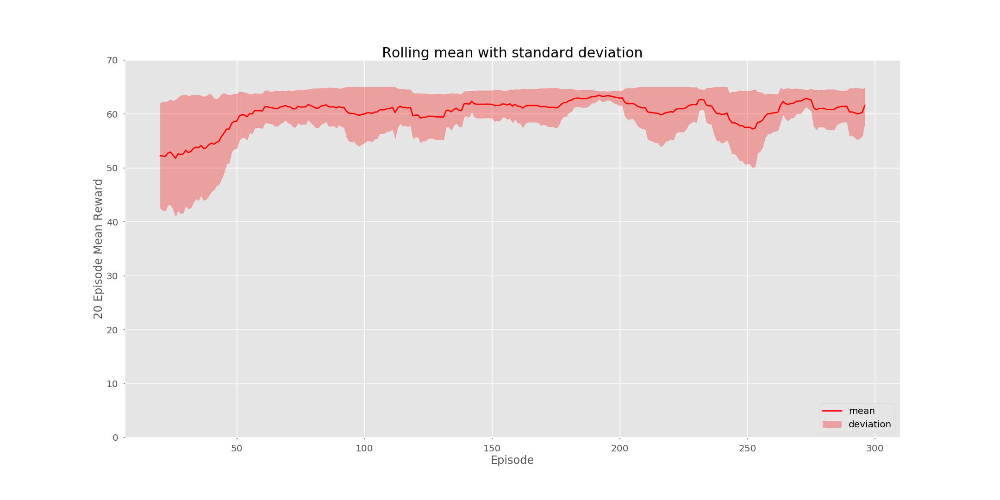
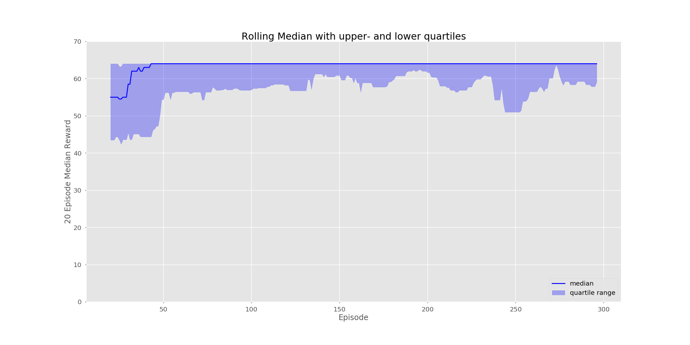
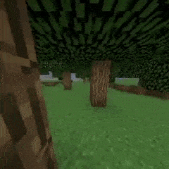

# DQN Reinforcement learning Project

Modular Deep Q Network project. Final goal is to reach a Rainbow DQN with the ability to toggle any feature 
beyond default DQN. Current working features included below.

Start training with `python main.py`. If using MineRL, changing command to `xvfb-run python main.py` for training
is recommended. To use expert data, set MINERL_DATA_ROOT environment variable to the location.

Environments currently available for training (can't guarantee functionality on other envs):
- MineRLTreechop-v0

## Features

- [x] DQN

- [x] Double DQN (Default is active, disable with `--no-double-dqn`)

- [x] Dueling DQN (Default is active, disable with `--no-dueling`)

- [x] n-step DQN (`--n-step N`, where `N=1` is the normal case)

- [x] Prioritized Experience Replay (Default is active, disable with `--no-prioritized`)

    - [x] Alternate uniform sampling memory (`--no-prioritized`)
    
- [x] Noisy Networks for Exploration (`--noisy`, use with `--greedy` for no e-greedy) [[credit](https://github.com/Kaixhin/Rainbow)]

- [x] C51 (`--use-c51`) [[credit](https://github.com/Kaixhin/Rainbow)]

- [x] Continuous -> Discrete

- [x] Action branching (active by default)

  - [ ] No branching option (Not yet fully tested, use with `--no-action-branching`)
  
- [x] MineRL Treechop

- [x] DQfD (changed margin loss to cross entropy, seems to work well with C51)

- [x] Logging

    - [x] Enable `wandb` logging (`--log-run`, combine with `--verbosity 0` to avoid large terminal upload.)
    - [x] Enable local csv logging (`--local-log`, stored in the [runs_recordings](/runs_recordings) dir.)

## Results

## Sample video
Click [here](https://youtu.be/tdrC33Zkulc) to see a better quality version at 1x speed.

## Requirements
Install with `pip install -r requirements.txt`. Install PyTorch v1.5 separately.

### Notes
This project was written for MineRL v2.9 and adapted for version 3.6. However, it still relies on version 1 of the human 
recorded data provided by the MineRL team.